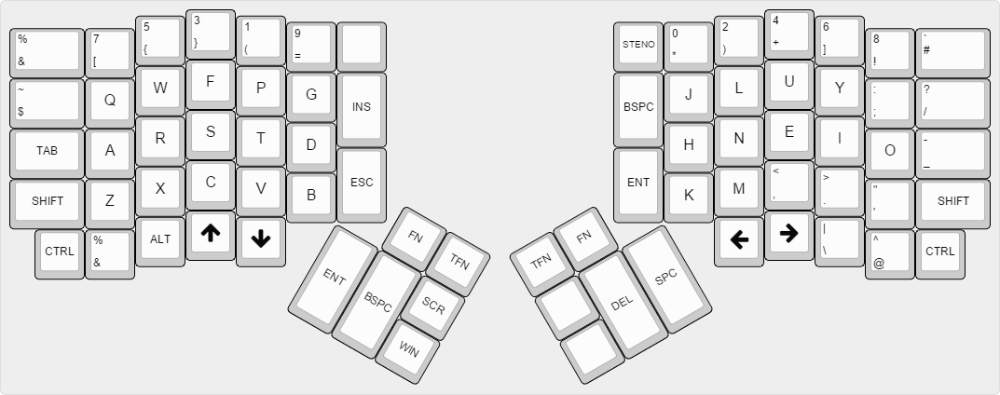
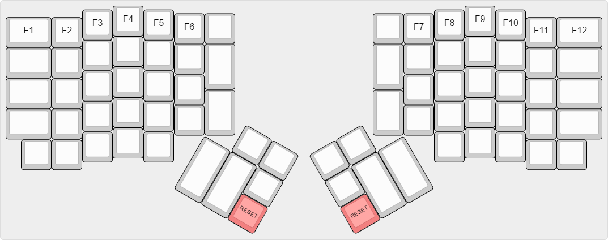
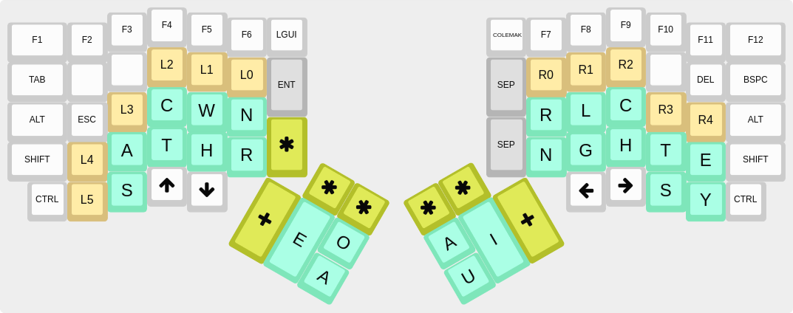
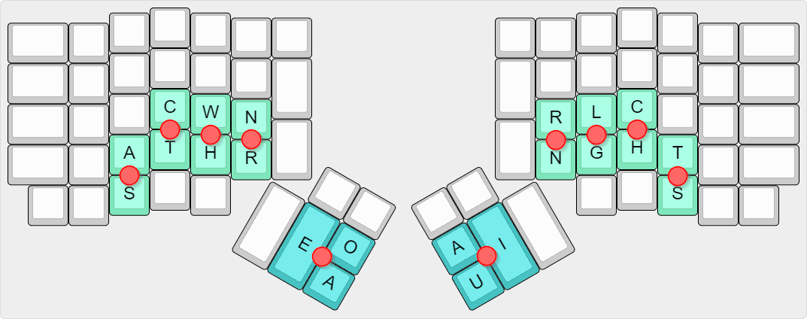
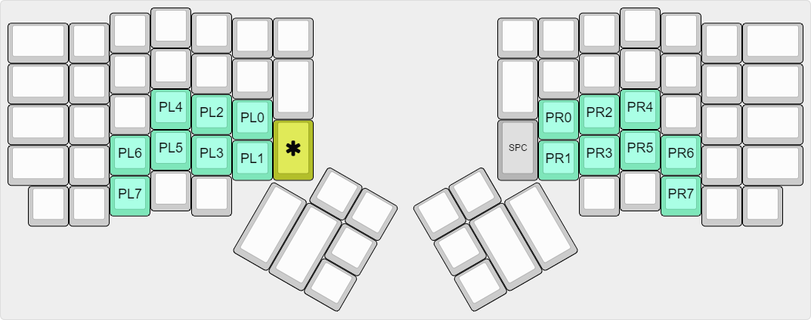

## Summary

It's a firmware-implemented custom Programmer Colemak layout and a firmware-implemented custom Programmer Steno layout (no Plover needed)

## Downloads

You can directly download .hex files from the release page : https://github.com/FromtonRouge/qmk_firmware/releases

## Programmer Colemak layout

(Inspired by the Programmer Dvorak layout : http://www.kaufmann.no/roland/dvorak)

It's basically a Colemak layout with the Programmer Dvorak numbers and symbols row.

## Fn Layer

The TEENSY key (RESET) is define in this layer

## Programmer Steno layout (experimental)

(Inspired by the Jackdaw steno theory https://sites.google.com/site/ploverdoc/jackdaw)

By default the keyboard is in full NKRO, you can test the keyboard here https://www.microsoft.com/appliedsciences/KeyboardGhostingDemo.mspx

Space is added automatically after a stroke

MSPC is the MetaSpace key :

    * When used in a stroke it cancels the space added automatically.
    * When used alone it adds a space.
    * When used with the STAR key, MSPC becomes a Backspace key.

Numbers are binary numbers : you can stroke 2 numbers at the same time (from 0 to 15 for each hand)

Home position :    
    

Punctuations (when * is used with the left or/and right hand) [WORK IN PROGRESS]:

### Lookup table for the left hand (Shelton table)

    A               =       A
    AB              =       A|C|T|W|H
    ABB             =       A|S|C|T|W|H
    ABBR            =       A|S|C|T|W|H|R
    ABL             =       A|C|T|W|H|N|R
    ABR             =       A|C|T|W|H|R
    ABY             =       A|C|T|W|H|N
    AC              =       A|C
    ACC             =       A|C|H|N
    ACCL            =       A|C|H|N|R
    ACCR            =       A|C|H|R
    ACH             =       A|C|H
    ACL             =       A|C|N|R                 (*)
    ACKN            =       A|T|W|H|N
    ACQ             =       A|C|T|N|R
    ACR             =       A|C|R
    AD              =       A|C|T
    ADD             =       A|C|T|W
    ADDL            =       A|C|T|W|N|R
    ADDR            =       A|C|T|W|R
    ADJ             =       A|S|C|T|W|N
    ADM             =       A|C|T|W|N
    ADR             =       A|C|T|R
    ADV             =       A|C|T|N
    AF              =       A|C|T|H
    AFF             =       A|C|T|H|N
    AFFL            =       A|S|C|T|H|N|R
    AFFR            =       A|S|C|T|H|R
    AFL             =       A|C|T|H|N|R
    AFR             =       A|C|T|H|R
    AFT             =       A|S|C|T|H|N
    AG              =       A|S|C|T
    AGG             =       A|S|C|T|W
    AGGL            =       A|S|C|T|W|N|R
    AGGR            =       A|S|C|T|W|R
    AGH             =       A|S|C|T|H
    AGL             =       A|S|C|T|N|R
    AGN             =       A|S|C|T|N
    AGR             =       A|S|C|T|R
    AH              =       A|H
    AJ              =       A|T|W|N
    AK              =       A|T|W|H
    AL              =       A|N|R
    ALL             =       A|W|N|R
    AM              =       A|W|N
    AMM             =       A|C|W|N
    AN              =       A|N
    ANN             =       A|S|N
    AP              =       A|C|W
    APH             =       A|C|W|H
    APHR            =       A|C|W|H|R
    APL             =       A|C|W|N|R
    APP             =       A|S|C|W|N
    APPL            =       A|S|C|W|N|R
    APPR            =       A|S|C|W|R
    APR             =       A|C|W|R
    AQ              =       A|T|N|R
    AR              =       A|R
    ARR             =       A|S|R
    AS              =       A|S
    ASC             =       A|S|C
    ASCR            =       A|S|C|R
    ASH             =       A|S|H
    ASK             =       A|S|T|W|H
    ASL             =       A|S|N|R
    ASM             =       A|S|W|N
    ASP             =       A|S|C|W
    ASPH            =       A|S|C|W|H
    ASPHY           =       A|S|C|W|H|N
    ASQ             =       A|S|T|N|R
    ASS             =       A|S|C|N
    AST             =       A|S|T
    ASTH            =       A|S|T|H
    ASY             =       A|S|H|N
    AT              =       A|T
    ATH             =       A|T|H
    ATHL            =       A|T|H|H|R
    ATR             =       A|T|R
    ATT             =       A|T|W
    ATTR            =       A|T|W|R
    AV              =       A|T|N
    AW              =       A|W
    AWH             =       A|W|H
    AX              =       A|S|T|W
    AY              =       A|H|N
    AZ              =       A|C|N
    B               =       C|T|W|H
    BL              =       C|T|W|H|N|R
    BR              =       C|T|W|H|R
    BY              =       C|T|W|H|N
    C               =       C
    CH              =       C|H
    CHR             =       C|H|R
    CL              =       C|N|R
    CR              =       C|R
    CRY             =       C|H|N|R
    CY              =       C|H|N
    D               =       C|T
    DEL             =       C|T|N|R
    DEM             =       C|T|W|N
    DER             =       C|T|W|R
    DEV             =       C|T|N
    DR              =       C|T|R
    DW              =       C|T|W
    DY              =       C|T|H|N
    F               =       C|T|H
    FL              =       C|T|H|N|R
    FR              =       C|T|H|R
    G               =       S|C|T
    GH              =       S|C|T|H
    GL              =       S|C|T|N|R
    GN              =       S|C|T|N
    GR              =       S|C|T|R
    GW              =       S|C|T|W
    GY              =       S|C|T|H|N
    H               =       H
    J               =       T|W|N
    JER             =       T|W|N|R
    K               =       T|W|H
    KL              =       T|W|H|N|R
    KN              =       T|W|H|N
    KR              =       T|W|H|R
    L               =       N|R
    LY              =       H|N|R
    M               =       W|N
    MR              =       W|N|R
    MY              =       W|H|N
    N               =       N
    P               =       C|W
    PH              =       C|W|H
    PHL             =       C|W|H|N|R
    PHR             =       C|W|H|R
    PL              =       C|W|N|R
    PN              =       C|W|N
    PR              =       C|W|R
    PY              =       C|W|H|N
    Q               =       T|N|R
    R               =       R
    RH              =       H|R
    S               =       S
    SC              =       S|C
    SCH             =       S|C|H
    SCR             =       S|C|R
    SER             =       S|R
    SERV            =       S|T|W|N|R
    SH              =       S|H
    SHR             =       S|H|R
    SK              =       S|T|W|H
    SL              =       S|N|R
    SLY             =       S|H|N|R
    SM              =       S|W|N
    SN              =       S|N
    SP              =       S|C|W
    SPH             =       S|C|W|H
    SPL             =       S|C|W|N|R
    SPR             =       S|C|W|R
    SPY             =       S|C|W|H|N
    SQ              =       S|T|N|R
    SS              =       S|C|N
    ST              =       S|T
    STR             =       S|T|R
    STRY            =       S|T|H|N|R
    STY             =       S|T|H|N
    SV              =       S|T|N
    SW              =       S|W
    SY              =       S|H|N
    T               =       T
    TH              =       T|H
    THR             =       T|H|R
    TR              =       T|R
    TRY             =       T|H|N|R
    TW              =       T|W
    TY              =       T|H|N
    V               =       T|N
    W               =       W
    WH              =       W|H
    WR              =       W|R
    X               =       S|T|W
    XR              =       S|T|W|R
    XY              =       S|T|W|H|N
    Y               =       H|N
    Z               =       C|N

### Lookup table for thumbs vowels

    A               =       A
    AI              =       A|I
    AU              =       A|U
    AUI             =       A|U|I
    E               =       E
    EA              =       E|A
    EAI             =       E|A|I
    EAU             =       E|A|U
    EAUI            =       E|A|U|I     Find something usefull here
    EI              =       E|I
    EO              =       E|O
    EOA             =       E|O|A
    EOAI            =       E|O|A|I     Find something usefull here
    EOAU            =       E|O|A|U     Find something usefull here
    EOAUI           =       E|O|A|U|I   Find something usefull here
    EOI             =       E|O|I
    EOU             =       E|O|U
    EOUI            =       E|O|U|I     Find something usefull here
    EU              =       E|U
    EUI             =       E|U|I
    I               =       I
    O               =       O
    OA              =       O|A
    OAI             =       O|A|I
    OAU             =       O|A|U
    OAUI            =       O|A|U|I     Find something usefull here
    OI              =       O|I
    OU              =       O|U
    OUI             =       O|U|I
    U               =       U
    UI              =       U|I

### Lookup table for vowels bigrams (when * is used with vowels)

    AA              =       A
    AE              =       E|A
    AIU             =       A|U|I
    AO              =       O|A
    EAIU            =       E|A|U|I         Find something usefull here
    EAO             =       E|O|A
    EE              =       E
    EIA             =       E|A|I
    EIO             =       E|O|I
    EIU             =       E|U|I
    EOAIU           =       E|O|A|U|I       Find something usefull here
    EOIA            =       E|O|A|I         Find something usefull here
    EOIU            =       E|O|U|I         Find something usefull here
    EOUA            =       E|O|A|U         Find something usefull here
    EUA             =       E|A|U
    EUO             =       E|O|U
    IA              =       A|I
    IE              =       E|I
    II              =       I
    IO              =       O|I
    IU              =       U|I
    OAIU            =       O|A|U|I         Find something usefull here
    OE              =       E|O
    OIA             =       O|A|I
    IOU             =       O|U|I           IOU instead of OIU (OIU never happens)
    OO              =       O
    OUA             =       O|A|U
    UA              =       A|U
    UE              =       E|U
    UO              =       O|U
    UU              =       U

### Lookup table for the right hand (Shelton table)

    B               =       G|C
    BL              =       L|G|C
    BLES            =       L|G|C|S
    BS              =       G|C|S
    BT              =       N|G|C|T
    BTS             =       N|G|C|T|S
    C               =       C
    CH              =       C|H
    CK              =       G|C|T
    CKL             =       L|G|C|T
    CKLES           =       L|G|C|T|S
    CKS             =       G|C|T|S
    CS              =       C|S
    CT              =       C|T
    CTS             =       C|T|S
    D               =       C|H|S
    D               =       N|L|G
    DG              =       G|C|H|S
    DL              =       R|N|L|G
    DS              =       C|H|T|S
    DS              =       N|L|G|S
    DTH             =       N|L|G|H|T
    DTHS            =       N|L|G|H|T|S
    F               =       G|C|H
    FL              =       R|L|G|C|H           (*)
    FT              =       G|C|H|T
    FTEN            =       N|G|C|H|T           (*)
    FTER            =       R|G|C|H|T           (*)
    G               =       G
    GG              =       N|G|C
    GGS             =       N|G|C|S
    GH              =       G|H
    GHS             =       G|H|S
    GHT             =       G|H|T
    GHTS            =       G|H|T|S
    GN              =       R|N|G
    GNS             =       R|N|G|S
    GR              =       R|N|G|C     (*)
    GS              =       G|S
    H               =       H
    HS              =       H|S
    K               =       G|T
    KL              =       L|G|T
    KS              =       G|T|S
    L               =       L
    LB              =       R|N|L|G|C
    LBS             =       R|N|L|G|C|S
    LCH             =       R|N|L|C|H
    LD              =       R|N|L|C|H|S
    LDS             =       R|N|L|C|H|T|S
    LF              =       L|G|C|H
    LG              =       L|G
    LK              =       R|N|L|G|T
    LKS             =       R|N|L|G|T|S
    LL              =       R|N|L
    LLS             =       R|N|L|S
    LM              =       R|N|L|G|H
    LMS             =       R|N|L|G|H|S
    LP              =       R|N|L|C|T
    LPS             =       R|N|L|C|T|S
    LS              =       L|S
    LT              =       L|T
    LTH             =       L|H|T
    LTS             =       L|T|S
    LV              =       R|N|L|H
    LVES            =       R|N|L|H|S
    M               =       N|G|H
    MB              =       N|G|C|H
    MBER            =       R|N|G|C|H               (*)
    MBERS           =       R|N|G|C|H|S             (*)
    MBS             =       N|G|C|H|S
    MP              =       N|L|G|C|H
    MPS             =       N|L|G|C|H|S
    MPT             =       N|L|G|C|H|T
    MPTS            =       N|L|G|C|H|T|S
    MS              =       N|G|H|S
    N               =       N
    NC              =       N|C
    NCES            =       N|C|S
    NCH             =       N|C|H
    ND              =       N|C|H|S
    NDS             =       N|C|H|T|S
    NG              =       N|G
    NGS             =       N|G|S
    NGTH            =       N|G|T|H
    NGTHS           =       N|G|H|T|S
    NK              =       N|G|T
    NKS             =       N|G|T|S
    NS              =       N|S
    NST             =       N|L|C|T
    NT              =       N|T
    NTH             =       N|H|T
    NTHS            =       N|H|T|S
    NTS             =       N|T|S
    P               =       L|C
    PH              =       L|C|H
    PHS             =       L|C|H|S
    PL              =       R|N|L|C
    PLES            =       R|N|L|C|S
    PM              =       R|N|L|G|C|H         (*)
    PMENT           =       R|N|L|G|C|H|T       (*)
    PMENTS          =       R|N|L|G|C|H|T|S     (*)
    PS              =       L|C|S
    PT              =       L|C|T
    PTH             =       L|C|H|T
    PTHS            =       L|C|H|T|S
    R               =       R
    RB              =       R|G|C
    RBS             =       R|G|C|S
    RC              =       R|C
    RCH             =       R|C|H
    RCS             =       R|C|S
    RD              =       R|C|H|S
    RDS             =       R|C|H|T|S
    RF              =       R|G|C|H
    RG              =       R|G
    RGH             =       R|G|H
    RGS             =       R|G|S
    RK              =       R|G|T
    RKS             =       R|G|T|S
    RL              =       R|L
    RLD             =       R|L|C|H|S
    RLDS            =       R|L|C|H|T|S
    RLS             =       R|L|S
    RM              =       R|N|G|H
    RMS             =       R|N|G|H|S
    RN              =       R|N
    RNS             =       R|N|S
    RNT             =       R|N|T
    RP              =       R|L|C
    RPS             =       R|L|C|S
    RS              =       R|S
    RST             =       R|N|L|T
    RSTS            =       R|N|L|T|S
    RT              =       R|T
    RTH             =       R|H|T
    RTHS            =       R|H|T|S
    RTS             =       R|T|S
    RV              =       R|N|C|H
    S               =       N|L
    S               =       S
    SH              =       N|L|H
    SHES            =       N|L|H|S
    SK              =       N|L|G|T
    SKS             =       N|L|G|T|S
    SM              =       N|L|G|H
    SMS             =       N|L|G|H|S
    SP              =       N|L|C
    SPS             =       N|L|C|S
    SS              =       N|L|S
    ST              =       N|L|T
    STS             =       N|L|T|S
    T               =       T
    TCH             =       C|H|T
    TH              =       H|T
    THS             =       H|T|S
    TL              =       R|L|T               (*)
    TLY             =       R|L|T|S             (*)
    TION            =       N|C|T
    TIONS           =       N|C|T|S             (*)
    TS              =       T|S
    V               =       N|H
    VES             =       N|H|S
    W               =       R|H
    WD              =       R|N|C|H|S
    WDS             =       R|N|C|H|T|S
    WK              =       R|G|H|T
    WKS             =       R|G|H|T|S
    WL              =       R|L|H
    WLS             =       R|L|H|S
    WN              =       R|N|H
    WNS             =       R|N|H|S
    WS              =       R|H|S
    WTH             =       R|N|H|T
    WTHS            =       R|N|H|T|S
    X               =       L|G|H
    XES             =       L|G|H|S
    XT              =       L|G|H|T
    Z               =       L|H
    ZES             =       L|H|S

### Lookup table for right pinky

    E               =       E
    ES              =       E|S
    EY              =       E|Y
    EYS             =       E|Y|S
    S               =       S
    Y               =       Y
    YS              =       Y|S

### Lookup table for user left punctuations (when * is used with the left hand)

    [WORK IN PROGRESS]

### Lookup table for user right punctuations (when * is used with the right hand)

    [WORK IN PROGRESS]

### Lookup table for left user symbols and punctuations

    [WORK IN PROGRESS]

    !                   =       0
    ESC                 =       1       For Vim
    ESC:                =       0|1     For Vim
    *                   =       2
    _                   =       3       Usefull for prefixing an attribute member in C++ (eg: _p)       Usefull for prefixing an attribute member in C++ (ed: _p)

### Lookup table for right user symbols and punctuations

    [WORK IN PROGRESS]

    D                   =       0       For words ending with ED
    'S                  =       1       Main control key for english contractions ('s, n't, 'll etc...)
    D                   =       0|1     For words ending with TED THED
    N'T                 =       1|2
    ING                 =       3       For words ending with ING
    'LL                 =       1|3   
    ER                  =       2|3     For words ending with ER
    ING                 =       4       For words ending with ING
    'VE                 =       1|4
    ER                  =       3|4     For words ending with ER
    ING                 =       5       For words ending with ING
    'D                  =       1|5
    ER                  =       4|5     For words ending with ER

    (*) = not in the original Shelton table
