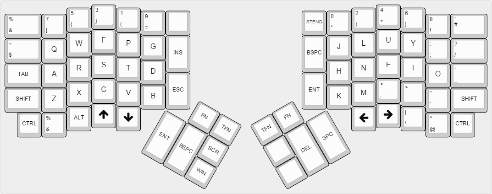
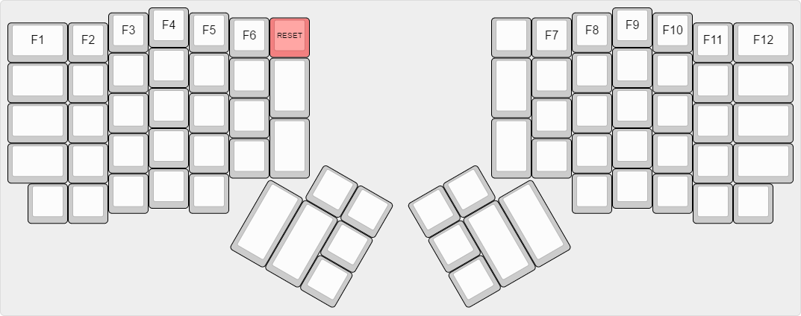
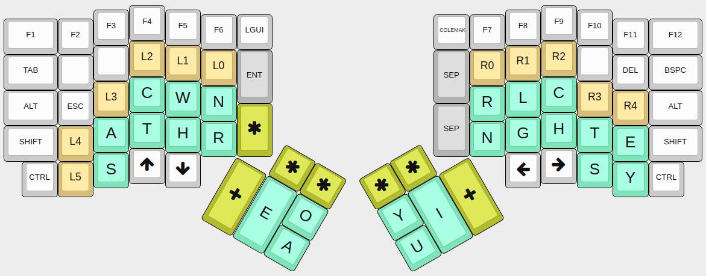
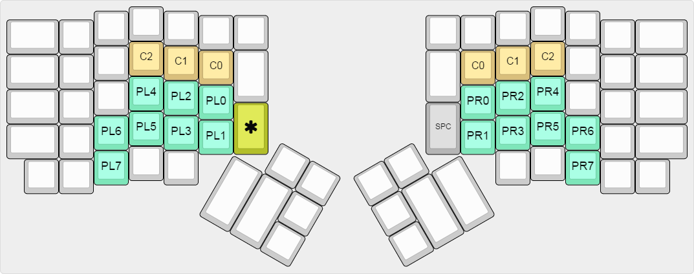

## Summary

It's a firmware-implemented Programmer Colemak layout and a firmware-implemented Programmer Steno layout (no Plover needed)

This keymap is compatible with :

    * Standard ErgoDox
    * ErgoDox EZ
    * Infinity ErgoDox

## Downloads

You can directly download binaries from the [release page](https://github.com/FromtonRouge/qmk_firmware/releases)

## Programmer Colemak layout

(Inspired by the Programmer Dvorak layout : http://www.kaufmann.no/roland/dvorak)

It's basically a Colemak layout with the Programmer Dvorak numbers and symbols row.

## Fn Layer

The TEENSY key (RESET) is define in this layer

## Programmer Steno layout (experimental)
**WARNING: I don't recommend this steno layout on an ErgoDox keyboard. Thumbs clusters are too far, I have been suffering from De Quervain tendinitis since April 2018 because of this. I'm waiting for a surgery on the left hand. My plan is to design a specific keyboard for this layout. If you still want to try this layout on the ErgoDox I recommend to reduce your training session time to under 30 minutes per day (be careful on left thumb moves). My speed was 140 wpm before the injury.**

**EDIT: Surgery done on October 2018 :**

**WARNING: I will remove this layout. If you want to use Jackdaw you need a [Kaladrius keyboard](https://github.com/FromtonRouge/qmk_firmware/tree/master/keyboards/handwired/kaladrius)**

(Inspired by the Jackdaw steno theory https://sites.google.com/site/ploverdoc/jackdaw)

By default the keyboard is in full NKRO, you can test the keyboard here http://random.xem.us/rollover.html

A separator character (space by default) is inserted automatically before a stroke.

SEP is the separator key :

    * When used in a stroke it cancels the separator inserted automatically.
    * When used alone it adds a separator.
    * When used with the STAR key, SEP becomes a Backspace key.

The separator character(s) can be changed by pressing at the same time LEFT PLUS, RIGHT PLUS and STAR keys and by stroking a symbol in the punctuation table

Numbers and Punctuation (when * is used with the left or/and right hand) [WORK IN PROGRESS]:

PL7 and PR7 are used to write numbers

### Programmer Steno Dictionaries

There are 3 main dictionaries:

* [Left Hand Dictionary](dictionaries/dict_left_hand.md) for initial letters
* [Thumbs Dictionary](dictionaries/dict_thumbs.md) for vowels
* [Right Hand Dictionary](dictionaries/dict_right_hand.md) for final letters

Left and right hands dictionaries were created by **Dothan L. Shelton**, you can find their first definitions [here](https://www.google.com/patents/US3970185)

List of all dictionaries:

* [Left Controls Dictionary](dictionaries/dict_left_controls.md)
* [Left Hand Dictionary](dictionaries/dict_left_hand.md)
* [Left Punctuation Dictionary](dictionaries/dict_left_punctuation.md)
* [Right Controls Dictionary](dictionaries/dict_right_controls.md)
* [Right Hand Dictionary](dictionaries/dict_right_hand.md)
* [Right Pinky Dictionary](dictionaries/dict_right_pinky.md)
* [Right Punctuation Dictionary](dictionaries/dict_right_punctuation.md)
* [Thumbs Dictionary](dictionaries/dict_thumbs.md)
* [Thumbs Bigrams Dictionary](dictionaries/dict_thumbs_bigrams.md)

You can found all dictionaries in the same file [here](dictionaries/dict_all.md)

